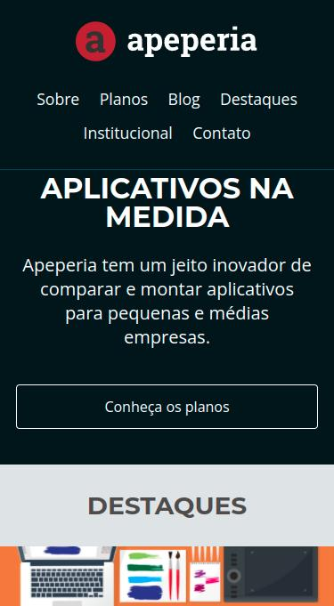

# Projeto Apeperia
Projeto desenvolvido no curso Layouts Responsivos: trabalhando com layouts mobile da Alura. Algumas partes dos arquivos .css foram preparadas pelo professor para podermos focar realmente no conteúdo da aula, mas me coloquei como desafio não copiar nenhum código feito após o código pronto inicial que foi liberado. O intuito desse curso foi explicar o conceito de mobile first e fazer layouts responsivos que mudam conforme o tamanho da tela do usuário.

- Layout Mobile 320px de Largura

- Layout Mobile 375px de Largura

- Layout Tablet

- Layout Laptop

- Layout Desktop
